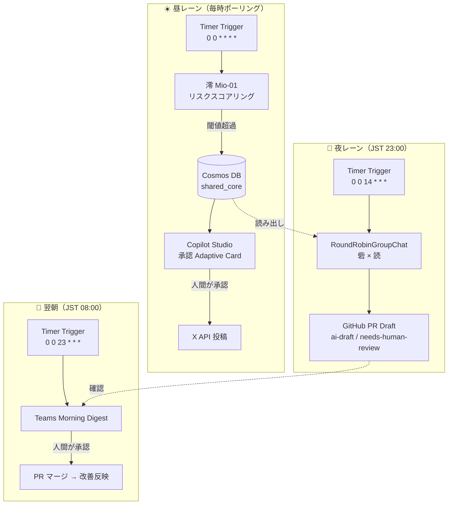

# おはようございます、昨夜の失敗、直しておきました。

> 「AI たちも、休む。だから引き継ぐ。引き継ぎが会議になり、昨日の失敗が今日の改善になる。」

---

## この記事について

朝、出社する。Slack を開く前に、AI からの一言が届いている——「おはようございます。昨夜の炎上リスク、対応案を PR にまとめておきました」。

これは、 **SNS 広報・運用担当者の朝を変える** ための実験です。昼は AI が発信トーンと炎上リスクを監視し、夜は AI 同士が自律的に集まって今日の判断を振り返り、翌朝には改善案（GitHub PR）が人間の出社前に用意されている。 **最終判断は必ず人間が下す（Human-in-the-loop）** ——そんなシステムを Azure × AutoGen × Copilot Studio で実装しました。

Microsoft Agent Hackathon 2026 への提出作品「 **AI 放課後 / After-Hours Agents** 」の技術解説記事です。マルチエージェント設計・Azure 構成・コスト試算まで、実装の中身を率直に書きます。

---

## プロダクトの全体像

### コンセプト：シフト制 AI と自律的な夜の会議

従来の炎上対応 AI は 24 時間休まず稼働し、均質な判断を繰り返します。私たちは逆を選びました。

**人間と同じシフト制を採用し、AI にも「休み」と「引き継ぎ」を与えました。**

8 体のエージェントは世代・専門領域・コミュニケーションスタイルを意図的にバラバラに設計しています。均質な AI が見落とす「機微」を、感知できる角度の違いが拾い上げる。持続可能な AI は、休み・繋がり・学ぶ。

### なぜ 24 時間均質 AI では不十分か

「24 時間休まず稼働する AI の方が炎上には強いのでは？」——この当然の問いへの答えが、シフト制採用の核心です。

**文脈は蓄積されないと消える。** 炎上対応は「今日の判断」が「昨日の判断」の文脈で変わります。多くの AI システムでは 24 時間稼働していても各リクエストが独立処理され、引き継ぎが発生しません。シフト制は **引き継ぎを強制** します。その引き継ぎが会話になり、昨日の失敗が今日の改善につながる。

**感知角度の多様性が内輪の合理化を防ぐ。** 夜勤の砦が昼勤の判断に反論できるのは、担当が変わるからです。同じエージェントが同じ文脈で判断し続けると、閾値が徐々にずれていきます。砦の口癖「反論できない対応は次の炎上の種」は、この構造的リスクへの処方箋です。

**最終判断は人間が担う（Human-in-the-loop）。** AI は「夜通し準備し、翌朝に人間が承認する」フローに徹します。炎上対応のような高感度業務において、最終判断を AI に委ねない設計だからこそシフト制が合う。シフトの切れ目が「人間確認のタイミング」になるのです。

> **想定反論**: 「24 時間稼働でもプロンプトに過去ログを継続注入すれば文脈は保てるのでは？」
> → 技術的には可能ですが、 **同一エージェントが同一観点で連続判断すると Anchor Bias（前の判断を肯定する方向にスコアが寄る）が累積** します。シフト制は判断主体そのものを切り替えることで、このアンカーを断ち切ります。砦の禁止語 `forbidden_words: ["問題ない", "大丈夫"]` は、この構造的バイアスへの明示的な処方箋です。

1 時間ポーリング（720 リクエスト/月）により、重大リスクワードを含む投稿を定期検知します。デモ時は HTTP エンドポイントによる即時トリガーも可能です（X API Pay-Per-Use・詳細はシステムアーキテクチャを参照）。

### 看板エージェント 3 体

| エージェント | 動物 | 担当 | キャラクター |
|------------|------|------|------------|
| **澪（Mio-01）** | 文鳥 🐦 | 炎上予測・昼番 | 「この投稿、3時間後に燃えます」|
| **砦（Toride-06）** | タヌキ 🦝 | 反論・クリティカル・夜番 | 「反論できない対応は次の炎上の種」|
| **読（Yomi-04）** | フクロウ 🦉 | パターン分析・夜番 | 「同じ火は、同じ場所からまた燃える」|

読は飲み会に参加しません。議事録だけ送ってきます。

> **実装スコープの誠実開示**: 提出版でコード実装まで到達したのは澪 / 砦 / 読の **3 体** です。残りのエージェントは Persona Card YAML 仕様とシフト体制設計のみで、実行コードはありません。限られたハッカソン期間で「キャラ数の広さ」よりも「実装の深さ」を優先した意思決定です。

---

## システムアーキテクチャ

全体像は「昼レーン（監視・対応）」と「夜レーン（振り返り・改善）」の 2 系統です。両者は Cosmos DB の共有メモリで繋がっています。



### 昼レーン（Daytime Lane）

```
Azure Functions Timer Trigger（NCronTab: 0 0 * * * * = 毎時 0 分・1 時間ポーリング）
  └→ 澪（Mio-01）: AutoGen AssistantAgent
      ├─ ルールベーススコアリング（リスクスコア 0-100）
      ├─ LLM 分析（Azure OpenAI gpt-4.1-mini / deployment: gpt-4-1-mini）
      └─ 閾値超過時 → Cosmos DB にインシデント記録
          └→ Copilot Studio: Adaptive Card 送信
              ├─ [承認] → X API で対応投稿を実行
              ├─ [修正] → 修正テキストで投稿
              └─ [キャンセル] → クローズ記録
```

> cron は Azure Functions Python の NCronTab 形式（`秒 分 時 日 月 曜` の 6 フィールド）で記述しています。

**Human-in-the-loop** の設計原則として、AI が提案し人間が最終判断する構造を徹底しています。炎上対応のような高感度業務において、AI の完全自律化ではなく「AI が夜通し準備し、人間が出社して承認する」フローが最適だと考えました。

### 夜レーン（Nighttime Lane）

```
Azure Functions Timer Trigger（NCronTab: 0 0 14 * * * = UTC 14:00 / JST 23:00）
  └→ Cosmos DB から本日のインシデント取得
      └→ RoundRobinGroupChat（AutoGen v0.4）
          ├─ 砦（Toride-06）: 「この対応、反論できますか？」クリティカル分析
          ├─ 読（Yomi-04）: 「過去に同じパターンがあります」パターン分析
          └─ MaxMessageTermination（4ターン）で自動終了
              └→ 振り返りサマリー → GitHub PR Draft 自動作成
                  （ai-draft / nocturne / needs-human-review ラベル）

Azure Functions Timer Trigger（NCronTab: 0 0 23 * * * = UTC 23:00 / JST 翌 08:00）
  └→ Teams Morning Digest Adaptive Card 送信
      └→ 担当者が出社前に確認 → PR マージ承認
```

### 共有メモリ設計（shared_core / private_episodic）

昼夜のエージェントが文脈を引き継ぐ核が、Cosmos DB の **二分割メモリ** です。

| コンテナ | パーティションキー | 内容 | アクセス |
|---------|----------------|------|--------|
| `shared_core` | `/container_type` | インシデント記録・夜間サマリー・投稿履歴 | 全エージェントが参照する組織知 |
| `private_episodic` | `/agent_id` | 各エージェントの内省ログ | 自分の `agent_id` 以外は read 禁止 |

`PrivateEpisodicRepository` は `agent_id` が一致しないアイテムへのアクセスで **`PermissionError` を物理的に送出** します。Persona Card の `cosmos_access.private_episodic_other: "none"` が、このコードレベルのアクセス制御に対応しています。

```python
class PrivateEpisodicRepository:
    """private_episodic コンテナ。自分の agent_id 以外は read 禁止。"""
    def __init__(self, agent_id: str) -> None:
        self._agent_id = agent_id

    def upsert(self, item: dict[str, Any]) -> dict[str, Any]:
        if item.get("agent_id") != self._agent_id:
            raise PermissionError(
                f"agent_id mismatch: {item.get('agent_id')} != {self._agent_id}"
            )
        return self._container.upsert_item(item)
```

「均質な組織知（shared_core）」と「多様な個別観点（private_episodic）」を物理的に両立させるための設計です。インフラ層（Bicep）では全エージェントに同一の Cosmos ロールを付与していますが、 **アプリ層のこのリポジトリ + Persona Card の `tools_allowed`** でエージェント別アクセスを担保しています。

---

## 実装詳細

### Persona Card YAML

各エージェントの人格・権限・動作モードを YAML で定義しています。

```yaml
persona_id: "Toride-06"
display_name:
  ja: "砦"
  en: "Toride"

base_persona:
  type: "hybrid"  # kinako 60% / mochi 20% / neko 20%
  traits:
    - name: "クリティカル思考"
      description: "反論できない対応案を見つけるまで指摘し続ける"
  animal:
    species: "タヌキ"
    emoji: "🦝"
  shift: "night"

mode:
  business:
    tone: "critical"
    forbidden_words: ["問題ない", "大丈夫"]  # 楽観的表現は禁止語

permissions:
  tools_allowed:
    - "cosmos_shared_read"
    - "cosmos_shared_write"
    - "github_pr_draft_create"
  identity:
    entra_agent_id_env: "ENTRA_AGENT_ID_TORIDE_06"
```

Persona Card は **装飾ではなく、ランタイムでシステムプロンプトを動的生成します** 。 `persona_loader.py` の `build_character_header()` が YAML から口癖・特性・禁止語を組み立て、各 `agent.py` の `_build_system_prompt()` に渡します。 `tools_allowed` フィールドは `_build_agent_tools()` で FunctionTool に変換され、エージェントが実際に呼べるツールを制御します。

また **ビジネスモードとカジュアルモードの 2 モード** を持ちます。昼間の業務分析は structured JSON 出力、夜の Group Chat では会話形式に切り替わります。

### 炎上リスクスコアリング（澪の判断ロジック）

ルールベースのスコアリングに LLM 分析を重ねる 2 段階設計です。

```python
_RISK_WEIGHTS: dict[str, float] = {
    "不買運動": 25,
    "訴訟": 25,
    "謝罪": 20,
    "差別": 20,
    "パワハラ": 20,
    # ... 計 14 キーワード
}

def calculate_risk_score(text: str, engagement_metrics: dict | None = None) -> tuple[float, list[str]]:
    matched: list[str] = [kw for kw in _RISK_WEIGHTS if kw in text]
    score = sum(_RISK_WEIGHTS[kw] for kw in matched)
    if engagement_metrics:
        rt = engagement_metrics.get("retweet_count", 0)
        score += min(rt * 0.1, 30.0)  # エンゲージメント補正（上限 30）
    return min(score, 100.0), matched
```

LLM 接続が失敗した場合でも、ルールベースにフォールバックして動作継続します。「AI が壊れたから対応できない」が起きない設計です。

### 夜の Group Chat 実装（AutoGen RoundRobinGroupChat）

砦と読の 2 エージェントが AutoGen `RoundRobinGroupChat` で今日のインシデントを共同レビューします。以下は戻り値の構造を示す抜粋です（完全な実装は `src/blueprints/night_lane.py` 参照）。

```python
from typing import Any
from autogen_agentchat.conditions import MaxMessageTermination
from autogen_agentchat.teams import RoundRobinGroupChat

async def _run_nocturne_group_chat(incidents: list[dict[str, Any]]) -> dict[str, Any]:
    team = RoundRobinGroupChat(
        participants=[get_toride_agent(), get_yomi_agent()],
        termination_condition=MaxMessageTermination(max_messages=4),
    )
    task_result = await team.run(task=_build_nocturne_prompt(incidents))

    messages = getattr(task_result, "messages", [])
    toride_msgs = [m for m in messages if getattr(m, "source", "") == "Toride_06"]
    yomi_msgs   = [m for m in messages if getattr(m, "source", "") == "Yomi_04"]

    return {
        "escalation_count": ...,   # 砦が「要エスカレーション」と判断した件数
        "yomi_patterns": [...],    # 読が検出した過去パターン一覧
        "actions": [...],          # 改善アクション（最大 5 件）
        "group_chat_messages": len(messages),
    }
```

**最大 4 メッセージで自動終了** （`MaxMessageTermination(max_messages=4)`）するため、コスト・時間が予測可能です。タスク初期メッセージを含むカウントのため、実質的なエージェント発話は 3〜4 回となります。

> 上記コードで `getattr(task_result, "messages", [])` と防御的にアクセスしているのは意図的です。AutoGen v0.4 の `TaskResult.messages` 要素型はバージョン間で `TextMessage` / `BaseAgentEvent` / `ChatMessage` を行き来するため、マイナーアップデートで壊れないよう属性アクセスを `getattr` でラップしています。

### GitHub PR Draft 自動生成

夜の合議結果は翌朝の GitHub PR Draft として自動生成されます。

```markdown
## 夜間振り返りサマリー
**日時**: 2026-04-17 23:00 JST

## 本日のインシデント実績
| インシデントID | リスクスコア | 人間の判断 | 結果 |
|-------------|------------|----------|------|
| incident_abc123 | 85 | approved | 公式謝罪を実施 |

## 砦（Toride-06）の指摘
「様子を見る」という対応案は即時対応の遅れがリスクになります

## 読（Yomi-04）のパターン分析
「品質問題」パターンの過去インシデント: 3 件。同じ火は、同じ場所からまた燃える。

## ⚠️ Human-in-the-loop 確認事項
- [ ] 提案アクションは業務ポリシーに沿っているか
```

PR には `ai-draft` / `nocturne` / `needs-human-review` ラベルが自動付与されます。人間がマージを承認するまで変更は反映されません。

---

## 技術スタック

| 層 | 技術 | 役割 |
|---|------|------|
| エージェント | AutoGen v0.4（autogen-agentchat・Microsoft 開発）| マルチエージェント協調・RoundRobinGroupChat |
| バックエンド | Azure Functions v4 ランタイム（Python v2 プログラミングモデル） | HTTP / Timer Trigger |
| データ | Azure Cosmos DB | shared_core + private_episodic |
| オーケストレーション | Copilot Studio + Power Automate | Scheduled Prompts・承認 Adaptive Card |
| SNS | X API v2（Pay-Per-Use） | 投稿監視・実投稿 |
| 認証 | User-Assigned Managed Identity（Entra Agent ID GA 後に移行予定） | アプリ層 + Persona Card でエージェント別アクセス制御 |
| メッセージング | Teams Adaptive Card v1.5 | Morning Digest・承認フロー |
| CI/CD | GitHub Actions（OIDC） | テスト・デプロイ |

### X API コスト試算

炎上監視はキーワード検索（`GET /2/tweets/search/recent`）で他アカウントの投稿を取得するため、
X API Pay-Per-Use の **General reads** が適用されます。Pay-Per-Use は API コール回数ではなく
**取得したリソース（投稿）件数** で課金され、General reads は **$0.005 / リソース** です。

| 構成 | 取得リソース量の目安 | 月額概算 |
|------|------------------|--------|
| keyword search 有効（リスクワード検索を常時実行） | 多（検索ヒット投稿を取得） | **約 $252 / 月** |
| keyword search 無効（自アカウント発信トーン監視に限定） | 少（自アカウント投稿のみ） | **約 $72 / 月** |

月額はポーリング回数（720 回/月）ではなく **取得投稿件数に比例** します。従来想定されていた商用炎上監視 SaaS（月 $5,000 規模）に対し、Pay-Per-Use と 1 時間ポーリングの組み合わせで **月 $72〜$252** に収めています。即時対応が必要な場面は HTTP トリガーで手動起動します（リアルタイム Filtered Stream を使わない誠実な設計）。

> 単価の根拠: X API 2026 年 4 月改定で General reads は $0.005 / リソース。自アカウントのデータ取得専用の
> Owned reads（$0.001 / リソース）はキーワード検索ユースケースには適用されません。

### LLM コスト試算（夜の Group Chat）

夜レーンの合議は **1 日あたり最大 4 メッセージ × 30 日 = 月 120 回程度** の LLM 呼び出しです。低単価な gpt-4.1-mini を使うため、X API コストに対して **無視できる水準** （月 $1 未満の概算）に収まります。昼レーンの澪も 1 投稿あたり短いプロンプトのため、LLM の支配的コストは発生しません。

> システム全体の月額ランニングコストは **X API が支配項** であり、合計でも **月 $100 前後（keyword search 無効構成）** で本番運用が成立します。

---

## デモシナリオ

1. **監視開始**: X API が炎上リスクワード「不買運動」を含む投稿を検出
2. **澪が分析**: リスクスコア 85 → インシデント登録 → Teams に Adaptive Card 送信
3. **人間が承認**: Copilot Studio 経由で「承認」ボタンをクリック
4. **澪が投稿**: X API で公式コメントを自動投稿
5. **23:00 夜の会議**: 砦が「様子を見る」対応を批評 → 読がパターンを分類
6. **GitHub PR 自動生成**: 「炎上予測スコア閾値を 70→60 に引き下げ」の改善案
7. **翌朝 8:00**: Teams に Morning Digest 到着 → 担当者が出社前に確認
8. **PR マージ承認**: 人間が内容確認して merge → 改善が反映

> 再現手順: `kai-kou/nocturne-agents` の README Quickstart 参照（`bash scripts/provision.sh dev` → `cd src && func start`）。ローカル検証は `cd src && python -m pytest tests/unit/` で実行できます。

---

## 設計のこだわり：なぜシフト制か

AI を 24 時間単一インスタンスで稼働させると 3 つの問題が生じます：

1. **疲弊なき判断の均質化** — 同じ閾値で同じ判断を繰り返し、文脈変化に鈍感になる
2. **振り返りの欠如** — 今日の判断が明日に活きない
3. **単一観点の脆弱性** — 1 体のエージェントが見落とすものを誰も補完しない

シフト制は「引き継ぎ」を強制します。引き継ぎが会話になり、会話がナレッジになる。 **AI の学習を「学習フェーズ」から切り離し、業務の中に埋め込む** のが After-Hours Agents の核心です。

---

## ハーネスエンジニアリング

炎上対応のように「AI が意図しない投稿をしてしまう」リスクが致命的になる領域では、人格設定や指示だけに頼るのは危険です。そこで本プロジェクトは、 **AI 自身の暴走を物理的に防ぐ「ハーネス」** を段階的に組み込み、AI エージェントの品質をコードで担保する「ハーネスエンジニアリング」を実践しています。

| レベル | 形態 | 実装例 |
|-------|------|--------|
| Lv1 | ドキュメント | CLAUDE.md、Persona Card YAML |
| Lv2 | AI セマンティックチェック | self-reviewer スキル（並列サブエージェント）|
| Lv3 | ハーネスフック（物理ブロック） | pre-git-push、pre-pr-create スクリプト |
| Lv4 | CI | GitHub Actions（Gemini + Copilot 並列レビュー・テスト自動実行）|

**「ルールを守らないと物理的に進めない」制約を段階的に組み込む** ことで、AI が暴走せずに人間の監督下で動く設計を実現しています。

---

## まとめ

- 🌙 **夜の自律合議** — AI が夜中に反省会を開いて改善案を作る
- ☀️ **朝の人間承認** — 出社したら改善案が PR になって待っている
- 🎭 **シフト制エージェント** — 均質でない AI が均質でない炎上を捉える
- 🔒 **Human-in-the-loop 徹底** — AI は提案し、人間が決める

> **「Agentic AI は、業務を奪うのではなく、夜を豊かにする。」**

---

## リポジトリ

- GitHub: [kai-kou/nocturne-agents](https://github.com/kai-kou/nocturne-agents)（公開済み）
- 実装言語: Python 3.11
- テスト: 提出リポジトリ `nocturne-agents` の pytest **85 件** （unit 76 + integration 9）。
  本番の炎上対応に使うため、LLM フォールバック・権限分離・スコアリング境界値を重点的にテストしています。
- 別途、本プロダクトを支える開発ハーネス（Lv1〜Lv4）側にも約 480 件のツールテストがあり、
  AI 自身の暴走を物理的に防ぐ仕組みを継続的に検証しています（後述「ハーネスエンジニアリング」）。

---

*Microsoft Agent Hackathon 2026 提出作品*
