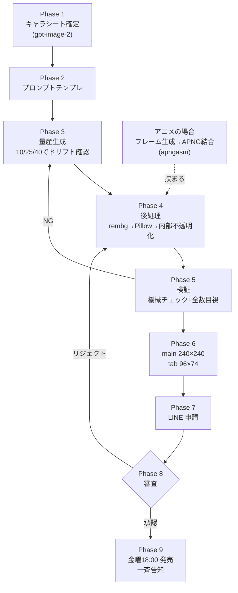

前章では「LINE スタンプ市場のリアル」と「なぜ AI 制作なのか」を確認しました。本章では、実際に 14 パック以上を制作・申請し、審査通過・販売の実績を積んだ制作パイプラインの **全体像** を一気に俯瞰します。

この本の残りの章は、ここで示す **9 フェーズ** のどこかを深掘りするものです。だからこの章を「地図」として頭に入れておけば、3 章以降で迷子になりません。具体的には、

- 何を、どの順番で作るのか（制作9フェーズ）
- どんなツールを使い、それぞれいくらかかるのか（技術スタックとコスト）
- どれくらいの期間で 1 パックが出せるのか（現実的なスケジュール）
- 始める前に何を準備すればいいのか（環境とアカウント）

を、実測値ベースで提示します。誇張も精神論もありません。1 パック 40 個の制作 API 費は **約 370〜510 円**、総制作コストは **約 750 円** ―― この数字を出すまでの工程を、これから分解していきます。

:::message
本章は無料公開章です。「AI でスタンプ、作れそうかも」と思ってもらうための見取り図として、惜しまず全工程を開示します。
:::

## 制作9フェーズの全体フロー

1 パック（静止画 40 個）を完成させるまでの工程は、9 つのフェーズに分かれます。まず全体の流れを図で示します。

```text
Phase 1  キャラシート確定        (Day 1-2)   ─┐ AI に「正解の顔」を覚えさせる
Phase 2  プロンプトテンプレ作成   (Day 2-3)    │ 量産の設計図を JSON 化する
Phase 3  量産生成               (Day 3-5)    │ reference を渡して 35〜40 枚生成
Phase 4  後処理                 (Day 5-7)    │ 背景除去・リサイズ・透過・最適化
Phase 5  検証                   (Day 7-8)    │ LINE 仕様チェック + 目視レビュー
Phase 6  メイン/タブ画像作成     (Day 8-9)    │ 販売用の看板画像を作る
Phase 7  申請                   (Day 9-10)   │ LINE Creators Market にアップロード
Phase 8  審査対応               (Day 10-13)  │ リジェクト時の修正・再申請
Phase 9  販売開始               (Day 14-)   ─┘ 金曜18時に発売・告知
```

各フェーズを 1〜2 文の要約・所要日数・詳説する章とあわせて表にすると、次のようになります。

| Phase | 内容 | 要約 | 所要日数 | 詳説する章 |
|-------|------|------|----------|-----------|
| **1** | キャラシート確定 | gpt-image-2 で 5〜8 枚の基本表情リファレンスを生成し、AI が量産時に参照する「正解の顔」を固める。ここがブレると全 40 枚がブレる最重要工程。 | 1〜2 日 | 第03章・第04章 |
| **2** | プロンプトテンプレ作成 | 40 個分の表情・ポーズ・テキストを `base_prompt + expression + pose + text` の組み立てで一貫した JSON にする。 | 1 日 | 第04章・第08章 |
| **3** | 量産生成 | 確定したリファレンス画像を渡して 35〜40 枚を生成する。10/25/40 枚目でドリフト（キャラ崩れ）をチェックし再キャリブレーションする。 | 2〜3 日 | 第05章・第06章 |
| **4** | 後処理 | rembg で背景除去 → Pillow でリサイズ・透過マージン付与・PNG-24 最適化。吹き出しの内部不透明化もここで担保する。 | 1〜2 日 | 第07章・第08章 |
| **5** | 検証 | `validate_sticker.py` で LINE 仕様（サイズ・透過・容量）を機械チェックし、全 40 枚を目視レビューする。 | 0.5 日 | 第09章 |
| **6** | メイン/タブ画像作成 | 240×240px のメイン画像（看板）と 96×74px のタブ画像（トーク内タブ）を作る。 | 0.5 日 | 第09章 |
| **7** | 申請 | LINE Creators Market に全画像をアップロードし、タイトル・説明・価格・販売エリアを入力して審査リクエストを送る。 | 0.5 日 | 第12章 |
| **8** | 審査対応 | 審査結果を待ち、リジェクト時は指摘内容（軽微・類似・AI 判定）に応じて修正・再申請する。 | 1〜14 日 | 第12章・第13章 |
| **9** | 販売開始 | 承認後、金曜 18:00 に発売日を設定し、マルチチャネルで一斉告知する。初動 48 時間が勝負。 | 当日 | 第13章・第14章 |

フロー全体を図にすると次のとおりです。前半（設計）に重心を置き、後半は機械的に流す形です。



:::message
アニメスタンプ（APNG）を作る場合は、Phase 3〜4 の間に「フレーム生成 → APNG 結合」という工程が挟まります（上図の点線）。APNG には「総再生時間がちょうど整数秒」「Pillow 製は弾かれる」といった固有の落とし穴があり、第10章・第11章で専門に扱います。本章では、まず静止画の基本フローを押さえてください。
:::

### なぜこの順番なのか

この 9 フェーズで一番伝えたいのは「**前半（Phase 1〜2）に時間をかけ、後半は機械的にこなす**」という重心の置き方です。

キャラシートとプロンプトテンプレは、いわば設計図です。ここが甘いと、Phase 3 で 40 枚生成したあとに「全部キャラがブレている」と気づき、まるごと作り直すことになります。逆に Phase 1〜2 を丁寧にやれば、Phase 3 以降はほぼ「型に流し込む」作業になります。

実際、後述の失敗事例（本書 V1〜V8 の記録）の多くは「設計を飛ばして量産に走った」ことが原因でした。急がば回れ、です。

## 技術スタック ― 使うツールと役割・コスト

このパイプラインは **「課金するのは AI 画像生成だけ、加工処理はすべてローカル無料」** という構成になっています。これがコストを 1 パック 750 円程度に抑えられる理由です。

| ツール | 役割 | 動作環境 | コスト |
|--------|------|----------|--------|
| **gpt-image-2**（OpenAI） | キャラシート生成・表情の量産。reference 画像を渡してキャラ整合性を保つ画像生成エンジン。本書の本番制作の主力。 | API（クラウド） | **従量課金**（後述・1 枚 **$0.053**＝1024×1024・medium の公開価格・2026 年時点） |
| **rembg**（BiRefNet モデル） | 背景除去。`birefnet-general` モデルで AI が被写体を切り抜き、透過 PNG にする。 | ローカル | **$0**（無料・OSS） |
| **Pillow**（PIL） | リサイズ・透過マージン付与・PNG-24 RGBA 保存・ファイル最適化。LINE 仕様への落とし込みを担う画像処理ライブラリ。 | ローカル | **$0**（無料・OSS） |
| **apngasm** 系ツール | アニメスタンプの APNG 結合。フレーム PNG を 1 つの APNG にまとめる。Pillow 製 APNG は LINE に弾かれるため必須。 | ローカル | **$0**（無料） |
| **自前検証スクリプト**（`validate_sticker.py` 等） | LINE 仕様の機械チェック（PNG-24 か・RGBA か・サイズ・容量・透過画素の有無）。申請前の品質ゲート。 | ローカル | **$0**（自作） |

:::message
画像生成エンジンの選択は、本書では検証の結果 **gpt-image-2 を本番の主力** に据えています。reference 画像を複数枚渡せる「5 本柱」プロンプト設計（第04章）と相性がよく、キャラ整合性が安定するためです。Gemini 系など他エンジンを量産に併用する構成もあり得ますが、本書のコスト試算・手順はすべて gpt-image-2 を基準に記載します。
:::

### コストの内訳 ― 課金はクラウドの 1 工程だけ

ポイントは、**お金がかかるのは Phase 1（キャラシート）と Phase 3（量産）の画像生成 API だけ** という点です。Phase 4 以降の後処理・検証はすべてローカルマシンで完結し、追加コストはゼロです。

これは副業として始めるうえで大きな安心材料です。「最初に高い機材やサブスクを契約しないと始められない」ということがありません。OpenAI の API に数百円チャージするだけで、1 パックが作れます。

## コスト試算 ― 1 パック 40 個でいくらかかるか

実際の制作 API 費を、1 パック（静止画 40 個）あたりで試算します。これは机上の見積もりではなく、複数パックを作った実測ベースの数字です。

| 項目 | 内訳 | 金額（USD） | 金額（JPY 概算） |
|------|------|-------------|------------------|
| gpt-image-2（キャラシート） | 基本表情 8 枚 | **$0.84〜1.06** | 約 130〜160 円 |
| gpt-image-2（量産） | 表情 35 枚 | **$1.58〜2.35** | 約 240〜350 円 |
| rembg（背景除去） | ローカル処理 | $0 | 0 円 |
| Pillow（リサイズ・透過） | ローカル処理 | $0 | 0 円 |
| 自前検証スクリプト | ローカル処理 | $0 | 0 円 |
| **API 費 合計** | | **$2.42〜3.41** | **約 370〜510 円** |

> 単価の基準は **1 枚 $0.053**（gpt-image-2 `1024×1024`・`quality=medium` の公開価格・2026 年時点。第06章で実測検証）。**キャラシートだけ 1 枚あたりが高め（実効 $0.10〜0.13）に見える**のは、基本表情ごとに **複数候補を生成してベスト 1 枚を選抜する**（＝表情あたり約 2 生成ぶんを見込む）ためです。量産（35 枚）は 1 表情 1 生成が基本なので、$0.045〜0.067/枚と基準値どおりに収まります。

つまり **1 パック分の AI 生成コストは 370〜510 円**。ここに、試行錯誤の再生成（崩れた画像のリトライ）や、メイン/タブ画像の生成分などを加味した **総制作コストはおおむね 750 円** に収まります。

:::message alert
この数字には「人件費（あなたの作業時間）」は含まれていません。1 パックに 8〜24 日かけるとすると、時給換算では決して割に合いません。スタンプ制作は「1 パック単体で稼ぐ」ものではなく、**シリーズを積み上げて累積効果を狙う**ものだと、コスト感の段階から理解しておいてください。収益の現実は第13章で正直に扱います。
:::

### なぜこんなに安いのか

40 枚で 500 円弱という安さは、「量産生成」を低コストに保てるからです。1 枚あたり数円〜十数円の画像生成を 35 回繰り返しても、合計で数百円にしかなりません。

一方で、後述するように **「一括シート方式」（1 枚の画像に複数スタンプを並べて生成し、後で分割する）でさらにコストを 1/7 に下げる**ことも技術的には可能です。ただし本書では、それは品質とのトレードオフで本番には使わない、という結論に至っています（理由とデータは第06章で詳説します）。**コストを削るより、80 点の品質を安定して出すことを優先する** ―― これが本書の一貫した立場です。

## 制作期間の現実 ― 8〜24 日、バッファ込みで最大 3 週間

「2 週間あれば 1 パック出せる」とよく言われますが、これは **すべてが順調に進んだ場合のベストケース** です。現実は審査次第で大きく振れます。フェーズ別の期間目安を示します。

| Phase | 内容 | 期間 |
|-------|------|------|
| Phase 1 | キャラシート確定 | 1〜2 日 |
| Phase 2 | プロンプトテンプレ作成 | 1 日 |
| Phase 3 | 量産生成 | 2〜3 日 |
| Phase 4 | 後処理 | 1〜2 日 |
| Phase 5 | 検証 | 0.5 日 |
| Phase 6 | メイン/タブ画像 | 0.5 日 |
| Phase 7 | 申請 | 0.5 日 |
| Phase 8 | **審査対応** | **1〜14 日** |
| Phase 9 | 販売開始 | 当日 |
| **合計** | | **8〜24 日**（最大 3 週間） |

制作そのもの（Phase 1〜7）は、慣れれば **正味 1 週間前後** で終わります。問題は **Phase 8 の審査** です。

:::message alert
**審査期間の罠**：LINE Creators Market の公式目安は「1〜3 営業日」ですが、2024〜2025 年の個人クリエイター事例では **実態 1〜2 週間** かかるケースが多くあります。さらにリジェクト（差し戻し）されれば、修正 → 再申請でもう 1 サイクル増えます。
:::

このため、本書では **発売日まで 3 週間以上のバッファを確保する**ことを強く推奨します。「来週の金曜に出す」と決め打ちで告知してしまうと、審査が間に合わず信用を失います。スケジュールは必ず審査の不確実性を織り込んで組んでください。

特に AI 生成スタンプは、後述の **[AI] ラベル**（2025 年 6 月以降、AI 生成・加工スタンプに自動付与）の関係で審査がシビアになりがちです。**無加工の AI 生成のみは審査落ちリスクが高い**ため、必ず人手加工（背景除去・テキスト追加・色調整）を加える前提でスケジュールを引きます。

## 始める前に必要な準備

実際に手を動かす前に、揃えておくべきものを 4 点に整理します。

### 1. OpenAI API キー

gpt-image-2 を使うために必要です。[OpenAI Platform](https://platform.openai.com/) でアカウントを作り、API キーを発行します。従量課金なので、まずは数ドル分をチャージしておけば 1 パックは十分作れます。

```bash
# 環境変数に API キーをセット（シェルの設定ファイルに書いておくと便利）
export OPENAI_API_KEY="sk-..."
```

### 2. Python 環境

後処理（rembg・Pillow）と検証スクリプトは Python で動きます。Python 3.10 以降を用意し、依存パッケージをまとめてインストールします。

```bash
# 仮想環境を作る（推奨）
python3 -m venv venv
source venv/bin/activate

# 依存をまとめてインストール
# rembg[cli] は背景除去本体、onnxruntime は推論バックエンド、
# Pillow は画像処理、openai は画像生成 API クライアント
pip install -r requirements.txt
```

`requirements.txt` には次のものを含めます。本書のコードを最後まで（後処理・連結成分処理・アニメ APNG 生成まで）動かすには、この全部が必要です。

```text
openai          # 画像生成 API クライアント
rembg[cli]      # 背景除去本体
onnxruntime     # rembg の推論バックエンド（CPU）
Pillow          # 画像処理（リサイズ・透過マージン・PNG最適化）
numpy           # アルファマスクの配列演算（solidify_alpha 等）
scikit-learn    # 連結成分ラベリング（内部不透明化・吹き出し穴埋め）
apngasm-python  # アニメ APNG 生成（第10・11章で必須）
```

:::message alert
**`apngasm-python` を省かないでください。** 第 10・11 章で詳述するとおり、**Pillow 製の APNG は LINE に弾かれます**。アニメーションスタンプを作るなら APNG Assembler（`apngasm-python`）が必須です。`numpy` / `scikit-learn` も第 07・08 章の内部不透明化・吹き出し穴埋め（連結成分処理）で使うため、4 行だけでなく上記すべてを入れてください。静止画スタンプだけを作るなら `apngasm-python` は後回しでも構いませんが、入れておいて損はありません。
:::

:::details rembg の初回実行について（折りたたみ）
`rembg` は初回実行時に BiRefNet モデル（数百 MB）を自動ダウンロードします。最初の 1 枚だけ少し時間がかかりますが、2 枚目以降はキャッシュされたモデルを使うので高速です。CPU バックエンド（`onnxruntime`）でも十分実用的な速度で動きます。
:::

:::message
**本書のコードの読み方。** 各章のコードは「要点が伝わる最小限の抜粋」です。`import` や補助関数を省略している箇所では、**その章の前後で定義済みのものを引き継ぐ**前提です（例: 画像保存の `save_b64_png` は第03章で定義、APNG 結合は第10章で `apngasm-python` を使用）。実際に動かすときは、①上の `requirements.txt` を全部入れる、②API キーを環境変数 `OPENAI_API_KEY` に設定する、③各章のスニペットを上から順に繋げる ―― の 3 点を満たせば再現できます。OpenAI の `b64_json` レスポンスを保存する `save_b64_png` のような頻出ヘルパーは、第03章の定義をそのまま使い回してください。
:::

:::details Windows で動かす場合（折りたたみ）
本書のコマンド例は macOS / Linux 前提です。Windows（PowerShell）では仮想環境の有効化だけ書き換えてください ―― `python -m venv venv` の後に **`venv\Scripts\Activate.ps1`**（`source venv/bin/activate` の代わり）です。`apngasm-python` は wheel が配布されているため `pip install` で入りますが、入らない場合は [apngasm 本体](https://github.com/apngasm/apngasm) のバイナリを入れて PATH を通すか、WSL2（Ubuntu）上で本書のコマンドをそのまま実行するのが最も確実です。
:::

### 3. LINE Creators Market アカウント

スタンプを申請・販売するためのアカウントです。[LINE Creators Market](https://creator.line.me/) で登録します。販売収益を受け取るための **売上の振込先設定（最低振込額 1,000 円〜）** も、このアカウントで行います。

審査には時間がかかるので、**制作を始める前にアカウント開設だけは済ませておく**のが鉄則です。作品が完成してからアカウントを作ろうとすると、本人確認などでさらに数日ロスします。

### 4. 「人手加工する」という心構え

技術的な準備ではありませんが、これが最も重要かもしれません。

前述のとおり、**AI が生成した画像をそのまま申請するのはリジェクトリスクが高い**です。本書のパイプラインは、AI 生成（Phase 1〜3）のあとに必ず **人手による加工**（Phase 4 の背景除去・透過処理、第08章のテキスト追加、色調整）を挟みます。これは品質のためだけでなく、「人の手が入ったオリジナル作品である」という審査上の前提を満たすためでもあります。

申請時には **AI 利用を正直に申告する**こと。隠すのではなく、「AI で生成し、人手で加工した」と透明に示すのが、長く続けるための正攻法です。

## 思想 ― 完璧主義より「80 点を 2 週間で出す」

最後に、本書全体を貫く制作思想を 1 つだけ共有させてください。

スタンプ制作は、いくらでも作り込めてしまいます。「もっとキャラを可愛く」「もっと表情を豊かに」「もっと枚数を」と追求すれば、半年でも 1 年でも溶けます。そして多くの人は、その完璧主義の途中で力尽きて 1 パックも出せずに終わります。LINE Creators Market の登録クリエイター 750 万人のうち **90% が売上ゼロ** という現実の、少なくない部分はここに原因があります。

本書が採るのは、その逆の **スタートアップ的なリリース思想** です。

:::message
**80 点のスタンプを 2 週間で出す。** 完璧を目指して半年遅延するくらいなら、まず 1 パックを世に出して、市場とユーザーの反応というフィードバックを得る。改善は次の弾でやればいい。
:::

この思想には実利的な裏付けもあります。スタンプは **シリーズの累積効果** で伸びる商品です。第 1 弾の購入者には、第 2 弾以降が出たときに **LINE から自動で通知**が飛びます。つまり「早く 1 パック目を出して、通知先（ファン）を 1 人でも増やす」ことが、半年後の月収 1〜3 万円ラインへの最短経路になるのです。1 パック単体の純利益（数百〜千円規模）に一喜一憂するのではなく、**出し続けられる人が勝つ** ―― これが、14 パック以上を実際に制作・申請してきた立場からの、いちばん正直な結論です。

だからこそ、本書のパイプラインは「速く・安く・繰り返せる」ことを最優先に設計されています。9 フェーズ・ローカル無料の後処理・1 パック 750 円という構成は、すべて「出し続けるため」のものです。

## この章のまとめ

- 制作は **9 フェーズ**（キャラシート確定 → プロンプトテンプレ → 量産生成 → 後処理 → 検証 → メイン/タブ画像 → 申請 → 審査対応 → 販売）に分かれ、**前半の設計（Phase 1〜2）に時間をかける**のが成否を分ける。
- 技術スタックは **gpt-image-2（課金）+ rembg・Pillow・apngasm・自前検証スクリプト（すべてローカル無料）**。お金がかかるのは画像生成だけ。
- 1 パック 40 個の API 費は **約 370〜510 円**、再生成等を含めた総制作コストは **約 750 円**。
- 制作期間は **8〜24 日**。制作自体は 1 週間前後だが、**審査は公式目安 1〜3 日でも実態 1〜2 週間**。発売日まで **3 週間以上のバッファ**を取る。
- 準備すべきは **OpenAI API キー・Python 環境・LINE Creators Market アカウント・人手加工する心構え** の 4 点。AI 利用は正直に申告する。
- 思想は **「完璧主義より 80 点を 2 週間で」**。シリーズの累積効果で伸びる商品なので、出し続けられる体制をパイプラインで担保する。

次章からは、この地図の出発点 ―― 最重要工程である **Phase 1「キャラクターシート設計」** に踏み込みます。AI に「正解の顔」をどう覚えさせるか、その具体的な作り方を見ていきましょう。
