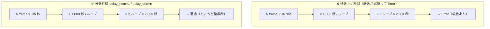

静止画スタンプが安定して通るようになったら、次に視野に入るのが **アニメーションスタンプ** です。動きで差別化でき、価格帯も 250 円〜（最小 8 個から）と単価が上がります。静止画が 120 円スタートなのに対し、アニメは下限が 250 円 ―― 初手から 2 倍超の単価をつけられる、これは魅力的に見えます。

しかし結論から言うと、アニメーションスタンプは **静止画とは別次元の罠** が待っています。この章では、第 3 弾アニメ（もっちー 24 個・社内コード V7）の量産から LINE Creators Market 申請までで実際に踏み抜いた罠と、そこから確定した **APNG の必須要件** を、実エラー文言と数値つきで共有します。

:::message
この章の最大の学びは、APNG の技術仕様そのものよりも **「エラーが出たときの初手」** にあります。技術要件の表だけ欲しい方は後半の「APNG 必須要件（実測確定）」へ飛んでも構いませんが、プロセス教訓を飛ばすと同じ無駄な周回をすることになります。
:::

## アニメで差別化する ―― が、その前に

アニメーションスタンプの仕様サマリーは以下のとおりです。静止画との違いを押さえておきましょう。

| 項目 | 静止画スタンプ | アニメーションスタンプ |
|------|---------------|----------------------|
| 個数 | 8 / 16 / 24 / 32 / 40 | 8 / 16 / 24 |
| 価格帯 | 120 円〜 | 250 円〜 |
| ファイル形式 | PNG-24 RGBA | **APNG**（専用ツール生成） |
| 1 ファイルサイズ | 1MB 以下 | **300KB 以下**（上限・超過でアップロード不可） |
| メイン画像 | 静止 PNG 240×240 | **アニメ APNG 240×240** |
| 制作難度 | ⭐ | ⭐⭐⭐ |

静止画は「1 枚を綺麗に透過して並べる」だけでしたが、アニメは **APNG というフォーマット固有の制約** が一気に増えます。そして LINE のアップロード画面は、その制約を満たしていないと **コマごとに「Error」バッジ** を返してきます。問題は、このバッジが **何が悪いのかを画面上では一見教えてくれない** ことです。

## プロセス教訓（本丸）: 推測で直さず「実際のエラー文言」を取りに行く

ここが、この章で一番伝えたい教訓です。

V7 では、ZIP をアップロードしたら **全アニメコマが Error** になりました。静止画の tab.png（静止 PNG）だけが通り、アニメ部分が全滅という状態です。ここで私たちは、**実エラー文言を見ずに「たぶんこれだろう」で 2 回修正を外しました。**

| 周回 | 推測した原因 | 取った対策 | 結果 |
|------|------------|-----------|------|
| 1 回目 | フレームサイズが不揃いだから | 全フレームを同一サイズに揃えた | **外れ**（apngasm 自身が可変サイズフレームを出力する＝同一サイズは要件ではなかった） |
| 2 回目 | Pillow 製 APNG だから | apngasm でエンコードし直した | **部分的に必要だが、これも真因ではなかった** |
| 3 回目 | （推測をやめる） | ユーザーに Error バッジをタップして実文言を見てもらった | **一発確定** |

3 回目に取得できた実エラー文言がこれです。

> 再生時間は、1秒、2秒、3秒、4秒のいずれかに設定してください。

これを見た瞬間に原因が確定しました。総再生時間が **ちょうど整数秒** になっていなかったのです（後述）。1 回目・2 回目の推測は、技術的には間違っていない要件ではあったものの、**今この Error を出している真因ではありませんでした。** 当てずっぽうの修正ループは、毎回ビルドし直してアップロードし直すコストがかかり、しかも「直した気になっているのに直っていない」ため信頼も削れます。

:::message alert
**エラー時の初手は「一次情報（実エラー文言・ログ）の取得」です。** UI 操作が必要で自分の手元に文言がないなら、推測で動く前に「Error バッジをタップして文言を見せてください」と即依頼する。これだけで V7 の 2 周分の無駄が消えました。原因を推測する前に、まず**機械が何と言っているか**を読むこと。
:::

この教訓は APNG に限りません。審査リジェクトも同じで、後述の透過リジェクトも「実文言（`※イラストの内部が透過されています`）」を読んで初めて真因にたどり着いています。

## APNG 必須要件（実測確定）

ここからが技術仕様です。下表は V7 で **実際にアップロード・申請を通すまでに確定した** 要件です。公式ガイドラインに書かれているものと、実測・実エラーで初めて分かったものが混在しています。

| # | 要件 | 罠・対策 |
|---|------|---------|
| 1 | **総再生時間がちょうど整数秒（1/2/3/4 秒）** | ★真因★ 端数があると Error。後述の「整数秒の壁」 |
| 2 | **APNG は APNG Assembler 系で生成**（Pillow 製は弾かれる） | `PIL.Image.save(save_all=True)` 製 APNG は全コマ Error。`apngasm` を使う |
| 3 | **片辺 270px 以上／320×270 以内** | 中身が小さいデザインは単体 Error。union bbox にクロップ→長辺 270 に拡大 |
| 4 | **全コマ同一データ禁止**（md5 が全て異なる） | 同一フレームばかりだと Error。フレーム数 5〜20 |
| 5 | **RGBA 8bit・背景透過** | colortype=6（RGBA）・8bit・背景は完全透明 |
| 6 | **ファイルサイズ 300KB 以下**（上限・超過でアップロード不可） | 超過時は寸法でなく**色量子化**で削る |
| 7 | **main=アニメ APNG 240×240／tab=静止 PNG 96×74** | main も APNG。tab だけ静止画 |

以下、特にハマりやすい #1〜#3 を掘り下げます。

### 要件 1: 整数秒の壁 ―― 「1 フレーム＝厳密に 1/n 秒」にする

これが V7 の真因であり、この章のサブタイトルにもなっている最大の罠です。

LINE は **総再生時間がちょうど 1 / 2 / 3 / 4 秒（整数秒）** であることを要求します。端数が 1 ミリ秒でもあると Error です。

V7 が引っかかった構成を見てください。

```text
6 フレーム × 167ms × 2 ループ = 2.004 秒  → Error
```

「6 フレームを 6fps（≒167ms/フレーム）で 2 ループ」と一見きりが良さそうですが、`1000ms ÷ 6 = 166.66…ms` を `167ms` に丸めた瞬間に端数が生まれます。`6 × 167 = 1002ms = 1.002 秒`、2 ループで `2.004 秒`。これが弾かれました。

正しいやり方は **遅延を ms（整数ミリ秒）で指定しない** ことです。APNG のフレーム遅延は `delay_num / delay_den`（分子・分母）の **分数** で指定できます。これを使い、1 フレームをちょうど `1/n` 秒にします。

```text
1 ループ = n フレーム × (1/n) 秒 = ちょうど 1.000 秒
総再生時間 = 1.000 秒 × loops 倍 = ちょうど整数秒
```

たとえば 6 フレームなら、各フレームの遅延を `delay_num=1 / delay_den=6`（＝厳密に 1/6 秒）にすれば、1 ループは `6 × 1/6 = 1.000 秒` ぴったり。2 ループで `2.000 秒` になり通ります。

「整数 ms 近似」と「分数遅延」で総再生時間がどう変わるかを並べると、なぜ前者が Error になるのかが一目で分かります。



:::message alert
**fps を割り切れない整数 ms 遅延（166ms / 167ms 等）にするのは厳禁です。** 「だいたい 6fps」では端数が累積して必ず Error になります。整数 ms で近似するのではなく、`delay_num=1, delay_den=n` の **分数指定** で 1/n 秒を厳密に表現してください。
:::

私たちのビルダー（`tools/build_apng_line.py`）では、この分数遅延を `_exact_delay` という関数で自動計算し、ループ数を掛けて整数秒になるよう組み立てています。検証関数 `verify()` がこの整数秒チェックを含む #1〜#6 を機械チェックし、出力 0 件なら OK という運用にしています。

### 要件 2: Pillow 製 APNG は LINE に弾かれる ―― エンコーダが真因

これも誤推定の歴史があります。最初の「全コマ Error」を見たとき、私たちは「全フレームのサイズが揃っていないからだ」と推測しました。しかしこれは外れでした。**apngasm 自身が可変サイズの差分フレームを出力する** ので、同一サイズは要件ではなかったのです。

真因は **エンコーダ** でした。Python の Pillow で `Image.save(save_all=True)` を使って生成した APNG（あるいはチャンクを自作した APNG）は、LINE のアップロードで **全アニメコマが Error** になります。面白いことに、ZIP に同梱した静止 PNG の tab.png だけは通るので、「フォーマットの問題」だと気づきにくいのです。

LINE 公式ガイドラインは **「APNG Assembler などのツールで生成すること」** を明記しています。これに素直に従い、Python から扱える `apngasm-python`（apngasm のバインディング）でエンコードすると通りました。

```python
# NG: Pillow で APNG を save すると LINE が全コマ Error にする
# img.save("anim.png", save_all=True, append_images=frames, ...)

# OK: apngasm（APNG Assembler）でエンコードする
from apngasm_python.apngasm import APNGAsm
asm = APNGAsm()
for frame_png in frames:           # 各フレームは RGBA8bit の PNG
    # 分数遅延で 1/n 秒を厳密指定（整数秒の壁・要件1）
    asm.add_frame_from_file(frame_png, delay_num=1, delay_den=n)
asm.set_loops(loops)               # ループ数（総再生時間を整数秒にする倍率）
asm.assemble("anim.png")
```

:::message
ポイントは「公式が指定したツールで作る」というシンプルな話なのですが、Pillow が普通に APNG を吐けてしまうために、つい自前で済ませて落とし穴にはまります。**APNG は専用ツールで作る** と覚えてください。
:::

### 要件 3: 片辺 270px 以上必須 ―― 「中身が小さい」と単体 Error

サイズ要件は **最大 320×270 以内、かつ幅か高さの一方が 270px 以上** です。この「以上」の条件を見落とすと、**1 コマ 1 コマは正しい透過 PNG なのにアップロードで Error** になります。

これは透明余白が多く **中身が小さいデザイン** で起きます。V7 では「回し車（A17）」のコマがこれに該当しました。回し車のオブジェクト自体が `230×230` 程度で、周囲に透明マージンを足しても **片辺が 270 に届かなかった** のです。

対策は、

1. 全フレームの不透明領域の **union bbox（合併バウンディングボックス）** を取る
2. その bbox にクロップして無駄な透明余白を落とす
3. **長辺を 270px に拡大** して片辺要件を満たす

という流れです。これも `build_apng_line.py` の `enforce_dims` が自動化しています。

```python
# 全フレームのアルファから union bbox を取り、クロップ→長辺270へ拡大
union = union_alpha_bbox(frames)          # 各コマの不透明領域の合併
frames = [crop(f, union) for f in frames] # 無駄な透明余白を除去
frames = scale_long_side_to(frames, 270)  # 片辺270px以上を満たす
```

:::message alert
拡大した分だけファイルサイズが増えます。ここで **寸法を縮めてサイズを削るのは禁物** です ―― 縮めると今度は片辺 270 を割って Error に逆戻りします。サイズ超過は **色量子化（パレット削減）** で対処してください（要件 6 とセット）。「寸法は要件で固定、削るのは色」と覚えると矛盾しません。
:::

### 要件 4〜7: 残りの確定事項

- **要件 4（全コマ同一データ禁止）**: 全フレームが同じ画像だと Error です。各フレームの **md5 が全て異なる** ことを `verify()` で機械チェックします。フレーム数は **5〜20** の範囲（V7 は 6 フレーム）。
- **要件 5（RGBA 8bit・透過）**: カラータイプは 6（RGBA）、8bit、背景は完全透明。
- **要件 6（ファイルサイズ）**: アニメーションスタンプの 1 ファイル上限は **300KB（ハードリミット・超過するとアップロードでエラーになり弾かれます）**。静止画の 1MB とは別物なので混同しないでください。前述のとおり超過時は **寸法でなく色量子化** で削ります。
- **要件 7（main / tab）**: **main 画像はアニメ APNG の 240×240**、**tab 画像は静止 PNG の 96×74** です。main までアニメにする点を忘れがちです。

## 内部不透明化（solidify）は全フレームに必要

静止画の章（第 07 章）で扱った **内部不透明化（solidify_alpha）** は、アニメでも **全フレームに適用** が必須です。むしろアニメの方が見落としやすく、ここで一度リジェクトを食らいました。

アップロード自体は通ったのに、**審査でリジェクト**。実文言はこうでした。

> 1.1 当社が定めるフォーマットに合致しないもの／※背景の一部が部分的に透過漏れ ＞IMG17／※イラストの内部が透過されています ＞該当多数

真因は、rembg（birefnet-general）のマットが甘く、キャラ内部に **穴（alpha=0）** と **半透明（0 < alpha < 255）** が残っていたことです。LINE は「イラスト内部は完全不透明・背景は完全透明」を要求します。`solidify_alpha()` を全フレームに適用し、(1) 背景漏れの孤立島を除去、(2) 内部の穴を埋める、(3) シルエット内を alpha=255 に 2 値化、(4) 黒フリンジを近傍色で補間 ―― この処理を入れて再申請で通りました。

:::details solidify の検証でハマった「偽の内部穴」
apngasm は差分フレーム（可変サイズ）を出力するため、PIL の `seek(i)` で中間・最終フレームを読むと、差分情報しか入っていないコマで **偽の内部穴** が大量に検出されます。これに気づかず「solidify が効いていない」と誤認しかけました。solidify は全コマ一律に適用しているので、**検証は frame 0（フル IDAT のコマ）で行えば代表として十分** です。
:::

## この方式の限界 ―― 次章への伏線

V7 ではもう一つ、致命的な指摘を受けました。透過を直して再申請しようとしたところ、動画確認で **「各アニメがシームレスでない／アニメ内でキャラの大きさが変わる」** という問題が浮上したのです。

真因は、gpt-image-2 で複数コマを **個別生成** すると、コマごとにキャラの大きさ・位置・形が **ドリフト** し、ループの先頭と末尾も繋がらない（非シームレス）ことでした。これは個別生成方式の **構造的限界** です。整数秒・apngasm・片辺 270・solidify をすべて満たしても、「動きとして綺麗にループしない」問題は残ります。

この **非シームレス／サイズドリフト問題** は、次章（第 11 章・帯状シート方式）で根本から解決します。結論だけ先取りすると、「複雑なポーズ変化を個別生成する」のをやめ、「**1 枚の綺麗なキャラ画像＋プログラムによる周期モーション**」へ転換することで、シームレス・サイズ一定・低コストを同時に達成しました。

## 申請メタの知見（文字数カウントの罠）

最後に、アニメに限らず申請全般で効く知見を 2 つ。

**文字数は全角 2 カウント** です。LINE のタイトル・説明の文字数上限は **半角換算** で、**全角 1 文字＝2 カウント** になります。

| 項目 | 上限（半角換算） | 日本語での実質 |
|------|----------------|--------------|
| タイトル | 40 | 約 20 文字 |
| 説明 | 160 | 約 80 文字 |
| コピーライト | 50 | 約 25 文字 |

検証は `unicodedata.east_asian_width` を使い、`W`（Wide）/`F`（Fullwidth）/`A`（Ambiguous）の文字を 2、それ以外を 1 として合計します。

```python
import unicodedata

def line_count(s: str) -> int:
    return sum(2 if unicodedata.east_asian_width(c) in "WFA" else 1 for c in s)

# 例: "もっちー（ハムスター）の動くスタンプ" = 18字 = 36カウント（上限40に収まる）
```

もう一つは **提示フォーマット** の工夫です。申請画面はタイトル（英/日）・説明（英/日）・クリエイター名・コピーライト・価格・タグなど入力欄が多く、長文の塊で渡すと申請者がスクロールを往復して該当箇所を探す羽目になります。**項目ごとに 1 個ずつコピペできる自己完結フォーマット**（各項目を個別のコードブロックに分ける）で提示すると、貼り間違いも往復もなくなります。

## この章のまとめ

- アニメーションスタンプは 250 円〜・最小 8 個から差別化できるが、APNG フォーマット固有の制約で **静止画とは別次元の罠** がある。
- **エラーが出たら推測で直さず、まず実エラー文言を取りに行く**。V7 は実文言を見ずに 2 回外し、Error バッジの実文言「再生時間は、1秒、2秒、3秒、4秒のいずれかに設定してください。」で一発確定した。
- APNG 必須要件（実測確定）: ①総再生時間が **ちょうど整数秒**（1 フレーム＝厳密に 1/n 秒の分数遅延）②Pillow 製は弾かれる→ **apngasm** で生成 ③ **片辺 270px 以上**（union bbox クロップ→長辺 270 拡大）④全コマ同一データ禁止（md5 全異・5〜20 フレーム）⑤ RGBA 8bit 透過 ⑥ **300KB 上限（静止画 1MB とは別物）・超過は色量子化** ⑦ main=アニメ APNG 240×240／tab=静止 96×74。
- **内部不透明化（solidify）は全フレームに必須**。透過漏れ・内部透過は審査リジェクト対象。
- 申請メタは **全角 2 カウント**（`east_asian_width` で W/F/A=2）で計算し、**項目ごとに 1 個ずつコピペできる形** で提示する。

ここまでで「1 コマ 1 コマを正しい APNG にする」要件は揃いました。しかし「アニメとして綺麗にループし、キャラの大きさがブレない」という品質課題は残っています。次章では、個別生成の構造的限界を断ち切る **帯状シート（strip-sheet）方式** で、シームレス化とサイズ一定を量産レベルで実現する方法を解説します。
